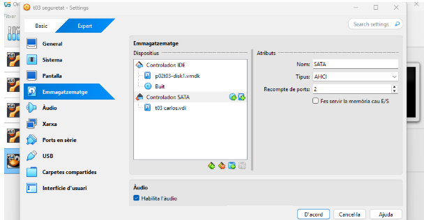
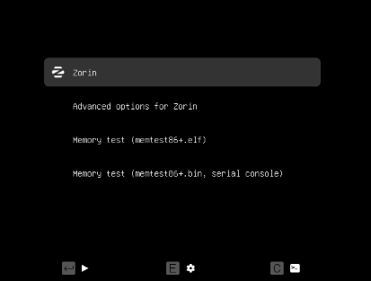
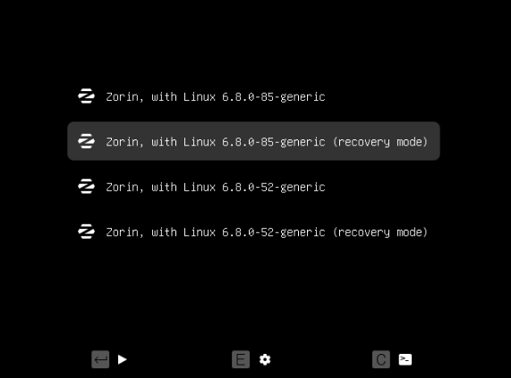
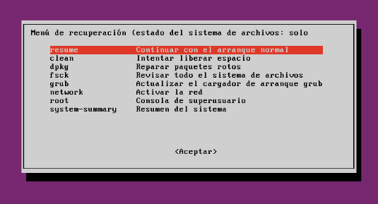
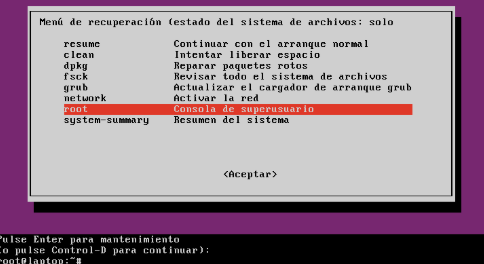
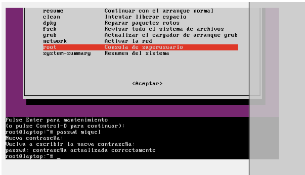
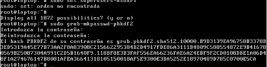
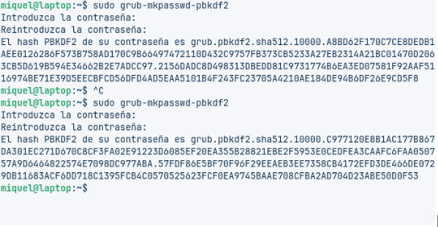

# 🔧 Solució T03: Seguretat Lògica

Aquí trobaràs la **solució de la tasca 03 (T03)**:  
**Seguretat Lògica — Recuperant accés a sistemes.**

## 🟢 PAS 1: Creació de la màquina virtual

Primer he creat una **màquina virtual nova** al **VirtualBox**.  

- Li he posat un **nom** identificatiu.  
- He canviat alguns **paràmetres** de configuració.  
- He afegit la **ISO de Zorin OS** per poder arrancar el sistema.  
- També hi he connectat el **disc virtual** que ens havien proporcionat per treballar-hi.  

✅ Amb això ja he pogut encendre la màquina i començar a seguir els passos per **recuperar la contrasenya**.





## 🟡 PAS 2: Accés al menú de GRUB

Ja he entrat a la **màquina virtual**, però com no conec la **contrasenya de l’usuari**, he fet el següent:  

- He premut **Shift + una tecla qualsevol** durant l’arrencada.  
- Això ha reiniciat la màquina i m’ha portat al **menú inicial de GRUB**.  
- Des d’aquí he escollit l’opció **Advanced** per continuar amb els passos de recuperació.





## 🟠 PAS 3: Accés al Root des de GRUB

- Un cop seleccionada l’opció **Advanced** al menú de GRUB, he escollit la **segona opció**, que m’ha portat a un altre menú.  
- Des d’aquest nou menú he seleccionat l’opció **Root** per obtenir accés al sistema com a administrador.






## 🔵 PAS 4: Canvi de contrasenya de l’usuari

Un cop entrat al sistema com a **Root**, ja podem interactuar i executar comandes.

He escrit la comanda:

El sistema m'ha demanat de crear una **nova contrasenya** i he escollit 
```bash
uruai123
```
 (8 caràcters).  
Acte seguit, l'he **repetit** per confirmar el canvi.

```bash
passwd miquel
```




## 🟣 PAS 5: Reinici i verificació de l’accés

Un cop canviada la **contrasenya**:  

- He reiniciat la **màquina virtual**.  
- Durant l'arrencada, he entrat amb l'**usuari corresponent**.  
- He comprovat que la **nova contrasenya funciona correctament**.  
- Ara ja podem accedir al sistema i continuar amb la resta de tasques sense problemes.


## ⚠️ PAS 6: Accedir a la configuració del GRUB

Vulnerar l'accés del **GRUB** del Linux —amb l'objectiu que només personal autoritzat hi pugui accedir— requereix tornar a editar la configuració del GRUB. Per fer-ho he obert el fitxer de personalització amb l'editor:

```bash
sudo nano /etc/grub.d/40_custom

```


# PAS 7 🧭

He entrat a la terminal des de la màquina virtual i he executat:

```bash
sudo nano /etc/grub.d/00_header
```

Acte seguit he posat això dins del fitxer (exemple escrit amb `cat << EOF`):

```bash
cat << EOF
set superusers="root,miquel"
password root 1234
password miquel 4321
EOF
```

---


---



