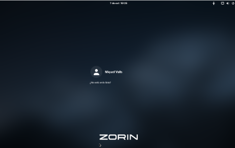

# 🔧 Solució T03: Seguretat Lògica

Aquí trobaràs la **solució de la tasca 03 (T03)**:  
**Seguretat Lògica — Recuperant accés a sistemes.**

## 🟢 PAS 1: Creació de la màquina virtual

Primer he creat una **màquina virtual nova** al **VirtualBox**.  

- Li he posat un **nom** identificatiu.  
- He canviat alguns **paràmetres** de configuració.  
- He afegit la **ISO de Zorin OS** per poder arrancar el sistema.  
- També hi he connectat el **disc virtual** que ens havien proporcionat per treballar-hi.  

✅ Amb això ja he pogut encendre la màquina i començar a seguir els passos per **recuperar la contrasenya**.

## 🟡 PAS 2: Accés al menú de GRUB

Ja he entrat a la **màquina virtual**, però com no conec la **contrasenya de l’usuari**, he fet el següent:  

- He premut **Shift + una tecla qualsevol** durant l’arrencada.  
- Això ha reiniciat la màquina i m’ha portat al **menú inicial de GRUB**.  
- Des d’aquí he escollit l’opció **Advanced** per continuar amb els passos de recuperació.

## 🟠 PAS 3: Accés al Root des de GRUB

- Un cop seleccionada l’opció **Advanced** al menú de GRUB, he escollit la **segona opció**, que m’ha portat a un altre menú.  
- Des d’aquest nou menú he seleccionat l’opció **Root** per obtenir accés al sistema com a administrador.  

